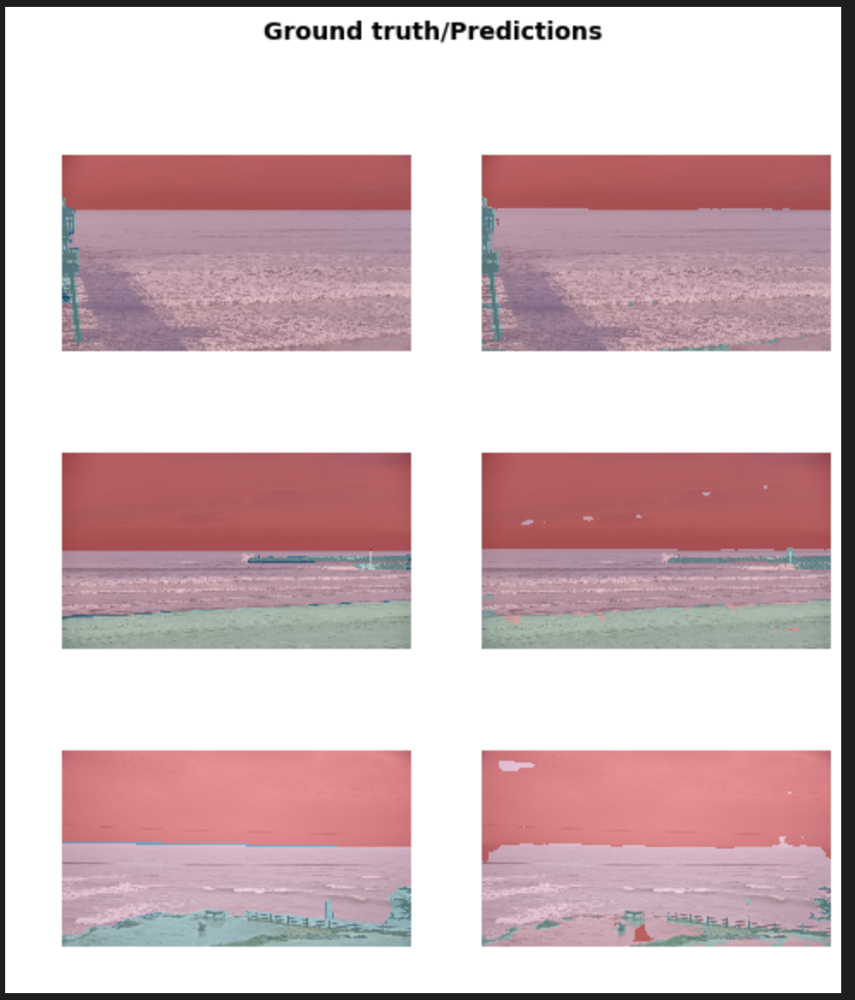

# froth

Image segmentation for surfcams

## Data

### Info

Image gathering is done by region through the batch region API. From there, images are pulled from each cams rewind clip.

The images are unaltered PNGs and labeled by spot ID.

The masks (aka labels) are class coded PNGs (0 - Sky, 1 - Ocean, 2 - Ground) and also labeled by spot ID.

Mask Legend (pre-mapped):

- Sky (0)
- Ocean (1)
- Ground (2)

### Setup

General requirements are:

- ffmpeg
- pipenv
- python3

Then:

```sh
$ pipenv install
$ pipenv shell
```

## ML

### Info

Results are relatively good. I think better labelling and more data will help a bunch. It looks like the coastline is getting predicted correctly most times so that's a big win (as that's the point of this exercise).



